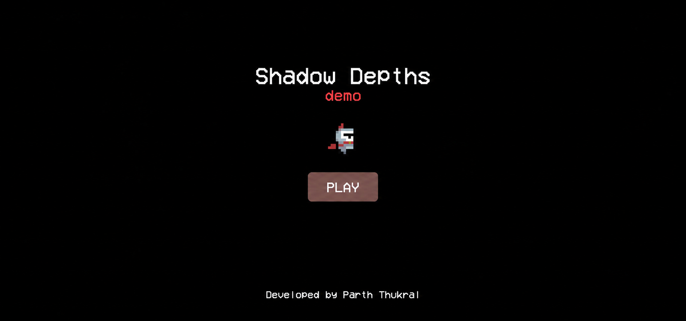
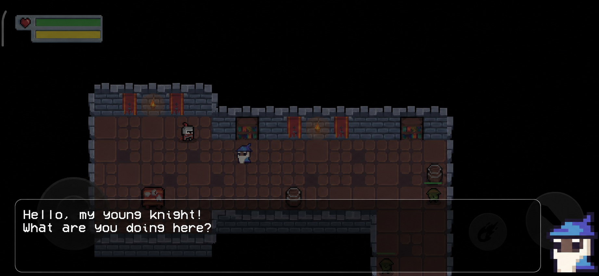
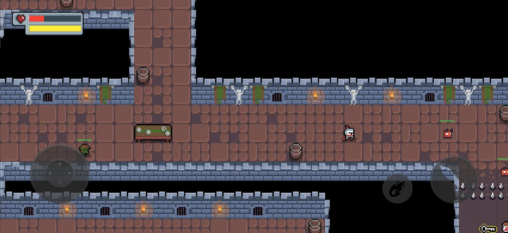

# Shadow Depths


A top-down 2D action RPG dungeon crawler. Descend into the dark depths as a brave Knight on a mission to rescue a kidnapped child from the creatures that dwell below.

## About the Game

You are a Knight, the fifth sent into the dungeon to rescue a kidnapped child. None of your predecessors returned alive. Armed with a sword and a fireball, you must fight through hordes of enemies, find the silver key, and face the Boss lurking in the depths to bring the child home.

### Gameplay Features

- **Exploration** — navigate a dark 50x50 dungeon lit only by torches
- **Combat** — melee sword attacks and ranged fireballs, gated by a stamina system
- **Enemies** — Goblins, Imps, Mini-Bosses, and a final Boss that summons reinforcements as its health drops
- **Puzzles** — find the silver key to unlock the door blocking your path
- **Dynamic Lighting** — a global darkness overlay pierced by your own glow and flickering torchlight
- **NPCs & Story** — dialogue-driven narrative from the Wizard and the Kid
- **Two Control Schemes** — virtual joystick (mobile) or keyboard (desktop)

### Controls

| Action | Keyboard | Mobile |
|--------|----------|--------|
| Move | Arrow keys | Joystick |
| Melee attack | Space | Button |
| Ranged attack | Z | Button |

## Screenshots





## How to Play

[Play in Browser](#)

Build the Android APK yourself:

```bash
flutter build apk
```

The release APK will be at `build/app/outputs/flutter-apk/app-release.apk`.

## Getting Started

This is a [Flutter](https://flutter.dev) project.

```bash
flutter pub get
flutter run                    # Default platform
flutter run -d chrome          # Web
flutter run -d android         # Android
flutter build apk              # Build Android APK
flutter build web              # Build for web
```

## Supported Platforms

Android, iOS, Web, Linux, macOS.

## Technology Stack

- **Language:** Dart
- **Framework:** Flutter
- **Map Editor:** Tiled
- **Localization:** English + Portuguese

## Credits

### Packages
- [flutter](https://flutter.dev)
- [flame_audio](https://pub.dev/packages/flame_audio)
- [flame_splash_screen](https://pub.dev/packages/flame_splash_screen)
- [url_launcher](https://pub.dev/packages/url_launcher)

### Sprites
- [DungeonTileset II](https://0x72.itch.io/dungeontileset-ii) by 0x72
- [Simple Dungeon Crawler](https://o-lobster.itch.io/simple-dungeon-crawler-16x16-pixel-pack) by o-lobster

## License

This project (excluding third-party sprites and assets, which remain the property of their respective authors) is released under the [MIT License](https://opensource.org/licenses/mit-license.php).

---

Developed by [Parth Thukral](https://parththukral.xyz).
